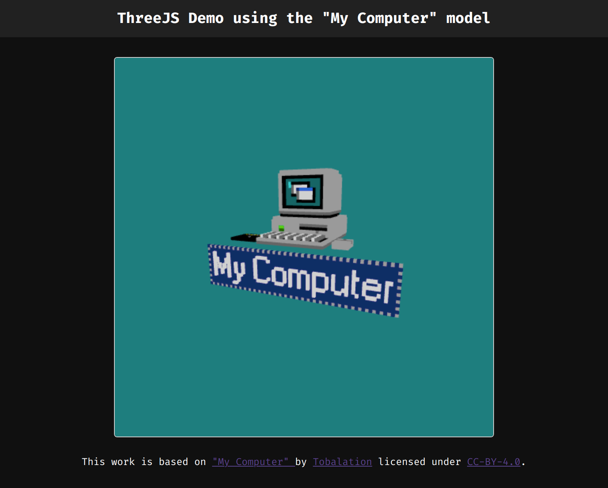

# ThreeJS Demo

---

## 📕 About

This project is a simple ThreeJS demo, utilizing its capabilites to render a 3d model on screen.

---

## ⚒️ Used Technologies

To develop this app, I used these technologies:

- Vite
- Typescript
- ThreeJS
- SASS

---

## ✨ Features

- Responsivity
- Visualization of a 3d model using ThreeJS.

---

## ⚙️ How to Use

First, clone the repository.

Inside the project folder, run `yarn` or `yarn install` to install the dependencies.

Then, run `yarn dev` to start a local development server.

---

## 🤝 Be a Contributor

Have any idea that can help boost the project, and want to share it? It's simple!

1. Fork the project
2. Modify what you want
3. Commit the changes
4. Open a Pull Request

---

## 🔓 License

This project is under license. Click [here](./LICENSE.md) for details.
